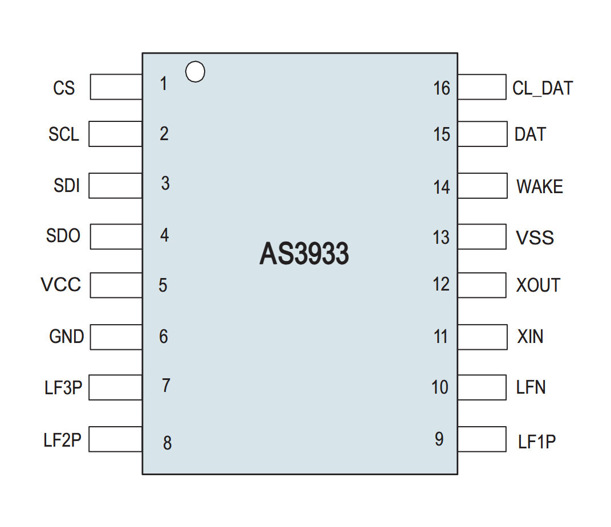

---
category:
  - RF
  - transceiver
manufacturer: ScioSense
footprint: TSSOP-16
value:
tolerance:
limit: V_CC=2.4-3.6 V
kicad: AS3933
link: https://www.digikey.de/de/products/detail/sciosense/AS3933-BTST/2812918
Tmin: -40
Tmax: 85
show_note: true
---
## alternative components

| Footprint | Part Number | Link                                                                    |
| --------- | ----------- | ----------------------------------------------------------------------- |
| TSSOP-16  | AS3933-BTST | https://www.digikey.de/de/products/detail/sciosense/AS3933-BTST/2812918 |
| QFN-16    | AS3933-BQFT | https://www.digikey.de/de/products/detail/sciosense/as3933-bqft/2812917 |

## pinout

