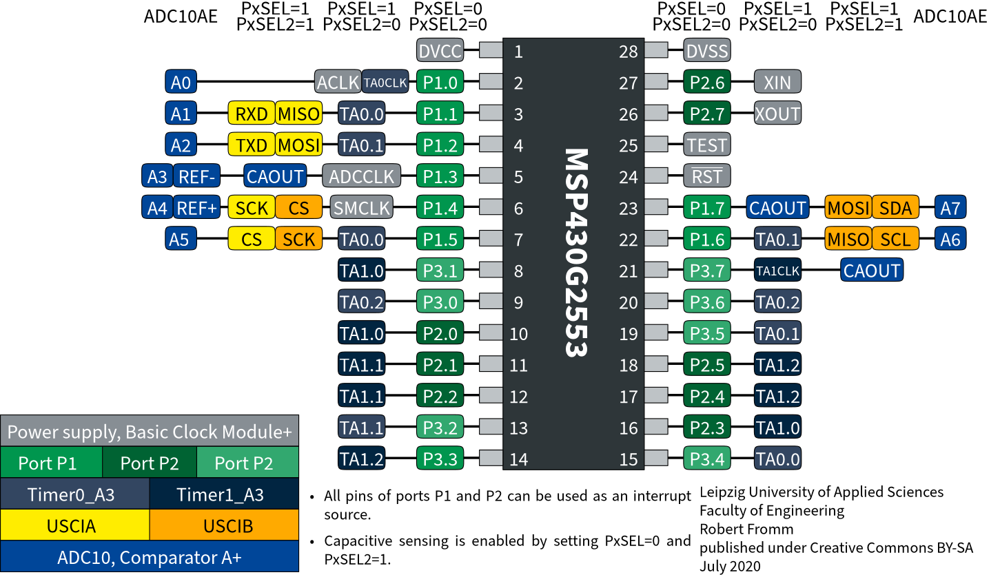

---
category:
  - microcontroller
  - MSP430
manufacturer: TI
footprint: TSSOP-28
value:
tolerance:
limit: V_CC=1.8–3.6 V
kicad:
link: https://www.mouser.de/ProductDetail/595-MSP430G2553IPW28
Tmin: -40
Tmax: 85
show_note: true
---
## alternative components

| Footprint | Packaging | Part Number       | Mouser                                                      |
| --------- | --------- | ----------------- | ----------------------------------------------------------- |
| TSSOP-20  | Tube      | MSP430G2553IPW20  | https://www.mouser.de/ProductDetail/595-MSP430G2553IPW20    |
| TSSOP-20  | Reel      | MSP430G2553IPW20R | https://www.mouser.de/ProductDetail/595-SP430G2553IPW20R |
| TSSOP-28  | Tube      | MSP430G2553IPW28  | https://www.mouser.de/ProductDetail/595-MSP430G2553IPW28    |
| TSSOP-28  | Reel      | MSP430G2553IPW28R | https://www.mouser.de/ProductDetail/595-SP430G2553IPW28R |
| QFN-32 | Tube      | MSP430G2553IRHB32T  | https://www.mouser.de/ProductDetail/595-P430G2553IRHB32T    |
| QFN-32 | Reel | MSP430G2553IRHB32R | https://www.mouser.de/ProductDetail/595-P430G2553IRHB32R |
| DIP-20 | Tube      | MSP430G2553IN20  | https://www.mouser.de/ProductDetail/595-MSP430G2553IN20    |

## pinout

see https://github.com/RobFro96/MSP430Pinouts

