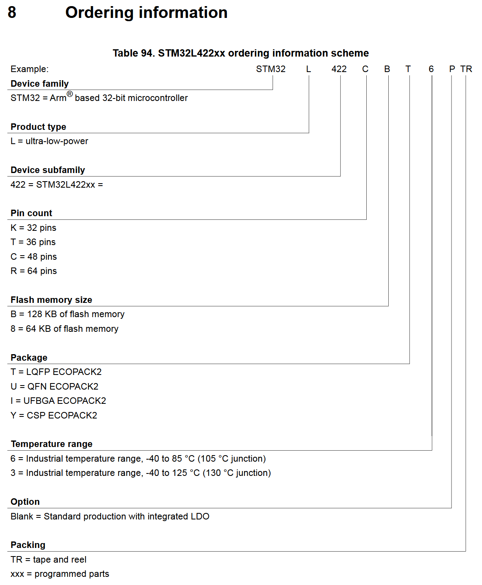

---
category:
  - microcontroller
  - STM32
manufacturer: STM
footprint: LQFP-32
value: 40 kB RAM, 128 kB Flash
tolerance:
limit: V_CC=1.71–3.6 V
kicad:
link: https://www.mouser.de/ProductDetail/511-STM32L422KBT6
Tmin: -40
Tmax: 85
show_note: true
---
